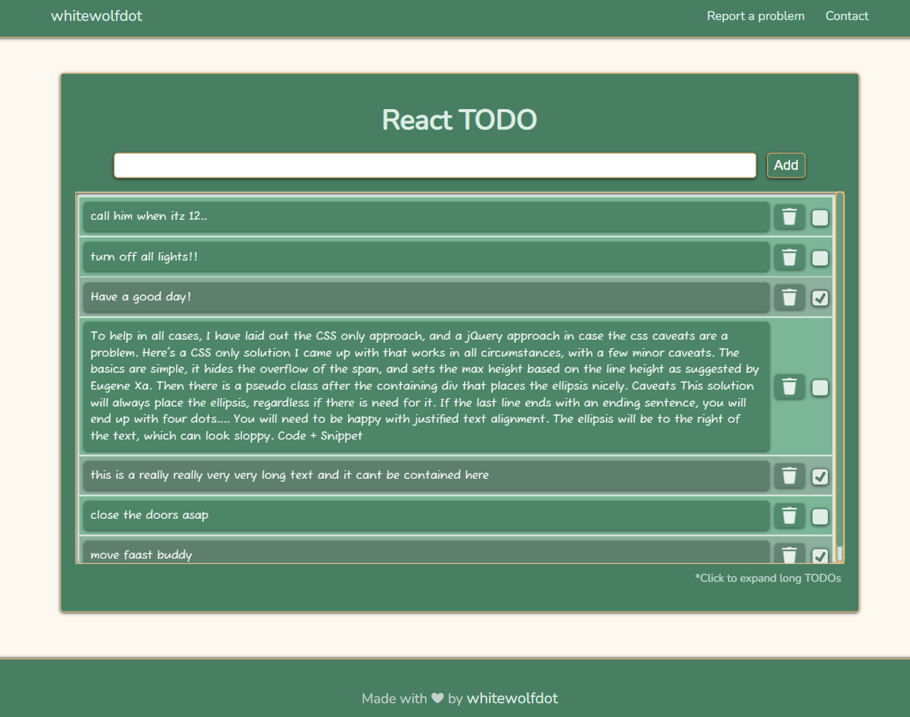

# React TODO

Simple **React TODO** app made using **React** framework with an awesome responsible UI.



## Features

- Save TODOs in list and displays it
- Stores TODO list in local storage(Browser's)
- Retains the list on Refresh and Rerun
- Build for simple personal use

## Run Locally

To copy and modify this project,

1.Clone this repo to your system

```bash
  git clone https://github.com/WhiteWolfDot/React-Todo.git React-Todo
```

2.Change folder

```bash
  cd React-Todo
```

3.Install dependencies, run

```bash
  npm Install
```

4.Make changes

3.Install dependencies, run

```bash
  npm start //or yarn start
```

## Contributing

Contributions are always welcome!

See [contributing guidlines](docs/contributing.md) for ways to get started.

Please adhere to this project's [code of conduct](docs/code-f-conduct.md).

## Authors

- [@whitewolfdot](https://www.github.com/whitewolfdot)
